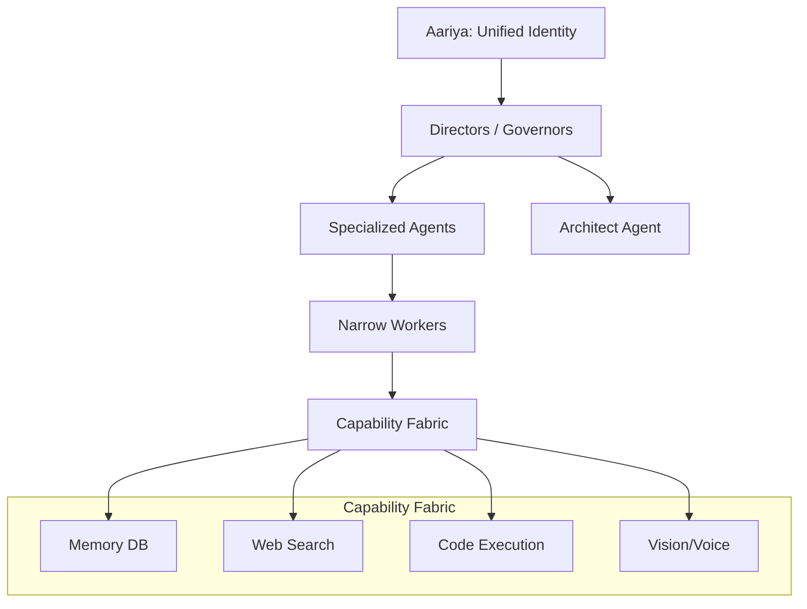

<div align="center">
  <h1>🧠 Aariya OS</h1>
  <p><b>A Dynamic Agent Civilization & Cognitive Identity Framework</b></p>
  
  [](https://github.com/Crazysenuuu/Aariya/actions)
  [](LICENSE)
  [](https://www.python.org/downloads/)
  [](https://reactjs.org/)
</div>

<br />

Welcome to **Aariya** — an advanced, autonomous AI application serving as a unified **Cognitive Identity** that manages a dynamic civilization of intelligent agents. Built with a full-stack React frontend and a Python backend, Aariya represents a paradigm shift from flat collections of AI agents to a structured, hierarchical ecosystem.

---

## ✨ Key Features

- **🏛️ Civilization OS & Governor Layer:** Aariya does not micromanage individual tasks. Instead, a specialized "Dynamic Governor" continuously monitors system resources (CPU, Memory, Latency) and strategically activates, suspends, or terminates specialized agents based on task complexity and resource constraints.
- **🧬 Dynamic Agent Population:** Agents are not permanently fixed. They are spawned on the fly (e.g., a "Temporary Patent Analysis Agent") based on the capabilities needed to solve a specific problem, and safely terminated when the task is complete.
- **🔌 Capability Fabric:** System abilities (Web Search, Vision, PDF Generation, Memory, Python Execution) are independently addressable and hot-pluggable without modifying the core system.
- **🧠 Continuous Learning & Decision Memory:** The system maintains persistent memory of all major decisions and their outcomes. An internal "Architect Agent" observes long-term patterns to continuously redesign and optimize the agent civilization for the future.
- **👁️ Multi-Modal Subsystems:** Includes anomaly detection, voice interaction, sentiment analysis, and a sophisticated visual monitoring interface to visualize the internal "brain" and cognitive fields in real-time.

---

## 🏗️ Architecture

Aariya is structured hierarchically to mirror complex, living systems:



1. **Capabilities**: Discrete skills the system possesses.
2. **Workers**: Narrow operational executors.
3. **Agents**: Reasoners pursuing specific objectives.
4. **Directors / Governors**: Orchestrators coordinating the civilization.
5. **Aariya**: The unified intelligence, personality, and identity.

---

## 🚀 Quick Start

### 1. Prerequisites
- **Python 3.11+**
- **Node.js 18+** & npm/pnpm

### 2. Environment Setup
Clone the repository and set up your environment variables:
```bash
git clone https://github.com/Crazysenuuu/Aariya.git
cd Aariya
cp .env.example .env
# Edit .env with your relevant API keys and configurations
```

### 3. Backend Setup
Set up the Python virtual environment and run database migrations:
```bash
# macOS/Linux
./setup.sh

# Windows
.\setup.ps1
```

### 4. Running the System
You can run the full ecosystem (frontend UI + backend server) using the provided scripts:
```bash
# macOS/Linux
./run_gui.sh

# Windows
.\run_gui.bat
```

To run the CLI interface instead of the full GUI:
```bash
# macOS/Linux
./run_cli.sh

# Windows
.\run_cli.bat
```

### 5. Testing
Execute the backend test suite:
```bash
./run_backend_tests.sh
```

---

## 🤝 Contributing

We welcome contributions to Aariya! Whether you're adding new capabilities, optimizing the Governor layer, or fixing bugs, please check our [CONTRIBUTING.md](CONTRIBUTING.md) guidelines before submitting a Pull Request.
